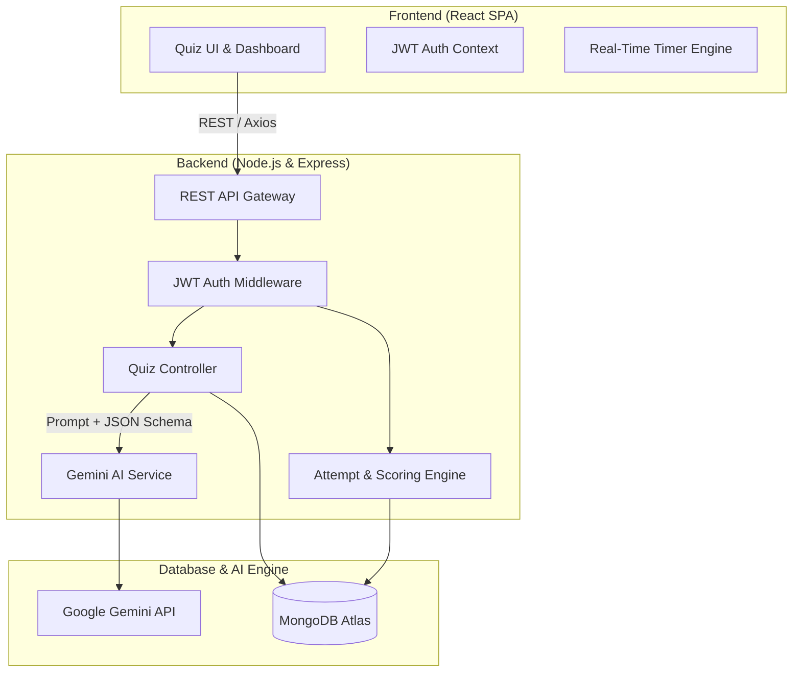

# 🧠 AI-Powered Quiz & Assessment Platform

> A production-ready, full-stack assessment platform leveraging **Generative AI (Google Gemini API)** for dynamic test generation, automated grading, and deep pedagogical feedback.

[](https://reactjs.org/)
[](https://nodejs.org/)
[](https://expressjs.com/)
[](https://www.mongodb.com/)
[](https://ai.google.dev/)

---

## 📌 Executive Summary & Client Value

Traditional assessment platforms rely on static question banks that are expensive to maintain, easily memorized by candidates, and slow to adapt to emerging technologies.

This project delivers an **AI-driven end-to-end assessment pipeline**:
1. **Dynamic Generation**: Generates customized multiple-choice tests across diverse technical topics and difficulty tiers in under 2 seconds using the **Google Gemini API**.
2. **Deterministic UI Parsing**: Uses strict **JSON Schema output constraints** to ensure error-free client rendering without parsing anomalies.
3. **Actionable Feedback**: Evaluates attempts instantly and provides deep-dive AI explanations for why answers were correct or incorrect.
4. **Candidate Analytics**: MongoDB aggregation pipelines track score trends, pass rates, and subject proficiency over time.
5. **Multi-Model Failover**: Intelligent failover between `gemini-3.5-flash-lite` and `gemini-3.7-flash` ensures zero downtime during traffic spikes.

---

## 🏗️ System Architecture



---

## 👥 Collaborative Team Roles

This repository reflects collaborative Git Flow development across core team branches:

| Contributor | Role | Core Contributions |
| :--- | :--- | :--- |
| **Manshu Kataria** | **Lead Full-Stack & System Architect** | System architecture, data flow modeling, database design, code reviews, and interview defense documentation |
| **Sumit Salgotra** | **Backend & AI Integration** | Express REST APIs, Mongoose schemas, JWT auth flow, and Gemini API structured prompt engine |
| **Priya Sharma** | **Frontend Developer & UI/UX** | React SPA, Vite, Tailwind CSS layout, timer component, test player, and analytics dashboard |
| **Aryan Malhotra** | **Testing, QA & Automation Engineer** | Integration test scripts, validation logic, health checks, and database seeder automation |

---

## 🛠️ Technology Stack Breakdown

* **Frontend**: React.js 18 (Vite), Tailwind CSS, Lucide Icons, React Router DOM v6, Axios with JWT interceptors.
* **Backend**: Node.js 20, Express.js (Modular MVC architecture), CORS, Dotenv.
* **Security & Auth**: JSON Web Tokens (JWT), Bcrypt.js password hashing (10 salt rounds), route protection middleware.
* **Database**: MongoDB with Mongoose ODM (Schemas: `User`, `Quiz`, `Attempt`).
* **Generative AI**: Official Google Gen AI SDK (`@google/genai`), `gemini-3.5-flash-lite` model with `responseMimeType: "application/json"`.

---

## 🚀 Getting Started (Local Development)

### Prerequisites
- Node.js (v18 or v20+)
- MongoDB (Local instance or free MongoDB Atlas URI)
- Google Gemini API Key ([Get one free at Google AI Studio](https://aistudio.google.com/))

### 1. Clone & Install Dependencies
```bash
git clone https://github.com/your-username/ai-quiz-assessment-platform.git
cd ai-quiz-assessment-platform

# Install root dependencies
npm install

# Install server and client dependencies
npm run install:all
```

### 2. Environment Configuration
Create a `.env` file in the `server` directory:
```bash
cp server/.env.example server/.env
```
Populate `server/.env`:
```env
PORT=5000
NODE_ENV=development
MONGO_URI=mongodb://localhost:27017/ai-quiz-platform
JWT_SECRET=your_jwt_secret_key_12345
JWT_EXPIRES_IN=7d
GEMINI_API_KEY=your_actual_gemini_api_key_here
CLIENT_URL=http://localhost:5173
```

### 3. (Optional) Seed Sample Data & Quizzes
```bash
cd server
npm run seed
cd ..
```

### 4. Run the Full Application
```bash
# Runs both backend (port 5000) and frontend (port 5173) concurrently
npm run dev
```
Open **http://localhost:5173** in your browser.

---

## 📡 REST API Reference

### 🔐 Authentication (`/api/auth`)
| Method | Endpoint | Description | Access |
| :--- | :--- | :--- | :--- |
| `POST` | `/api/auth/register` | Register new user account | Public |
| `POST` | `/api/auth/login` | Authenticate credentials & return JWT (auto-provisions demo user) | Public |
| `GET` | `/api/auth/me` | Get logged-in user profile | Private |

### 📝 Quizzes (`/api/quizzes`)
| Method | Endpoint | Description | Access |
| :--- | :--- | :--- | :--- |
| `GET` | `/api/quizzes` | List all quizzes with filters | Public |
| `GET` | `/api/quizzes/:id` | Get specific quiz details | Public |
| `POST` | `/api/quizzes/generate-ai` | Generate dynamic quiz via Gemini AI | Private |
| `POST` | `/api/quizzes` | Create quiz manually | Private |
| `DELETE`| `/api/quizzes/:id` | Delete quiz (creator/admin) | Private |

### 📊 Attempts & Analytics (`/api/attempts`)
| Method | Endpoint | Description | Access |
| :--- | :--- | :--- | :--- |
| `POST` | `/api/attempts/submit` | Submit test answers, grade, and record attempt | Private |
| `GET` | `/api/attempts/my-attempts` | List past quiz attempts for logged-in user | Private |
| `GET` | `/api/attempts/analytics` | Aggregate pass rate, avg score, and difficulty stats | Private |
| `GET` | `/api/attempts/:id` | Get detailed attempt breakdown with AI explanations | Private |

---

## 🎯 Microsoft Technical Consultant Interview Defense Guide

*Use these structured explanations to articulate your architectural decisions with clarity and technical maturity during interviews:*

### Q1: "Why did you choose Google Gemini API for test generation rather than traditional static DB queries?"
> **Answer**:
> *"Static question banks suffer from two enterprise pain points: high content creation costs and question leaks. By integrating Gemini 3.5 Flash-Lite, our system dynamically generates unique assessments on any niche or emerging topic (e.g. React 18 Concurrent Mode, OAuth 2.0 PKCE, Microservices) in seconds. Furthermore, the model doesn't just produce questions; it generates contextual pedagogical explanations for each distractor, giving candidates personalized coaching upon test completion."*

### Q2: "How did you ensure the LLM outputs valid data without crashing your application?"
> **Answer**:
> *"LLM non-determinism is a known challenge. We solved this at two levels:
> 1. **Prompt & Schema Enforcement**: We configured Gemini's `responseMimeType: 'application/json'` with a strict JSON schema requiring question text, 4 options, a 0-indexed correct answer, and an explanation.
> 2. **Multi-Model Failover & Fallback Architecture**: We configured automated retry across high-availability models (`gemini-3.5-flash-lite` ➔ `gemini-3.7-flash`). If network disconnect occurs, our service handles it gracefully without crashing."*

### Q3: "Explain how Authentication and State Management are handled across your stack."
> **Answer**:
> *"We implemented stateless JWT authentication. When a user logs in, the Express backend verifies credentials using `bcrypt.compare` against hashed passwords (10 salt rounds) and signs a token with a 7-day expiry. On the React frontend, an `AuthContext` maintains user state and an Axios request interceptor automatically attaches the token (`Authorization: Bearer <token>`) to all outbound API requests. If a 401 response is encountered, the response interceptor automatically invalidates local state and redirects to login."*

### Q4: "How did you design your MongoDB schemas and handle analytics aggregation?"
> **Answer**:
> *"We balanced normalization and embedding:
> - **Quiz Schema**: Questions and options are embedded directly in the `Quiz` document because a quiz's questions are always read together as an atomic unit.
> - **Attempt Schema**: We embed a snapshot of the candidate's submitted answers alongside the correct answers and points awarded at the time of submission. This preserves historical accuracy even if the original quiz is modified later.
> - **Analytics**: We use MongoDB query aggregations in `attemptController.js` to compute candidate pass rates, average percentages, and difficulty distributions in $O(N)$ time."*

---

## 📜 License
This project is licensed under the MIT License - see the [LICENSE](LICENSE) file for details.
